# egui-map -- built-in themes

`egui-map` ships 15 named color palettes (`map::theme::Theme`), each with a `Light` and a `Dark` variant (`map::theme::ColorMode`, a re-export of `egui::Theme`). `Theme::colors(mode)` resolves a theme to the seven colors the widget actually paints with (`map::theme::ThemeColors`): the node fill, connection lines (`segment`), the selection ring around the nearest node (`selected`), one-off notification/alert animations (`alert`), a lasting "this is marked" indicator -- a node's persistent state or a plain `update_marker` marker (`marker`) -- node names/labels (`text`), and the map canvas itself (`background`).

`SystemDefault` is the odd one out and the default theme: instead of a hand-picked palette, it carries over egui's own default `Visuals` colors (`hyperlink_color`, the separator-line color, `selection.stroke`, `warn_fg_color`, `error_fg_color`, and the active-widget text color, `strong_text_color()`), so a map with no theme installed looks like plain egui rather than an arbitrary house style.

Install a built-in theme, or your own palette, with `Map::set_theme` and the `MapTheme` trait -- see the README's "Custom themes" section and the `MapTheme` rustdoc for the full API.

Each theme below has its own preview, generated straight from the `Theme::colors` values in the table under it -- each card mocks the shapes the widget paints (nodes, connection lines, a selection ring, an alert ring, a marker ring), a node name label in the theme's actual `text` color, and the card itself filled with the theme's own `background`, rather than being a captured screenshot of a running app.

## `SystemDefault`

egui's own default `Visuals` colors (light and dark), carried over as a `Theme` instead of invented -- so a map with no theme installed looks like plain egui, not like an arbitrary house palette. The default theme.

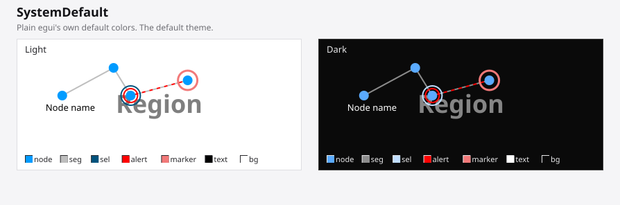

```rust
map.set_theme(std::rc::Rc::new(egui_map::map::theme::Theme::SystemDefault));
```

| Mode | node | segment | selected | alert | marker | text | background |
|---|---|---|---|---|---|---|---|
| Light | `#009BFF` | `#BEBEBE` | `#00537D` | `#FF0000` | `#F27979` | `#000000` | `#FFFFFF` |
| Dark | `#5AAAFF` | `#8C8C8C` | `#C0DEFF` | `#FF0000` | `#F27979` | `#FFFFFF` | `#0A0A0A` |

## `SlateOcean`

Muted blues over slate grays.

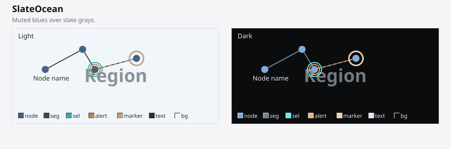

```rust
map.set_theme(std::rc::Rc::new(egui_map::map::theme::Theme::SlateOcean));
```

| Mode | node | segment | selected | alert | marker | text | background |
|---|---|---|---|---|---|---|---|
| Light | `#446285` | `#43484C` | `#3AADAD` | `#BF8448` | `#BFA284` | `#2B2F33` | `#F1F6FB` |
| Dark | `#80ADE0` | `#748394` | `#61EBEB` | `#F2B06E` | `#F2D1B0` | `#DDE6F0` | `#0B0C0D` |

## `NebulaViolet`

Violet and teal on a soft neutral backdrop.

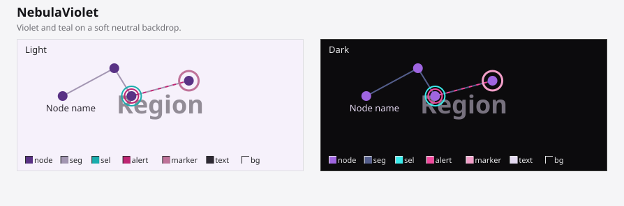

```rust
map.set_theme(std::rc::Rc::new(egui_map::map::theme::Theme::NebulaViolet));
```

| Mode | node | segment | selected | alert | marker | text | background |
|---|---|---|---|---|---|---|---|
| Light | `#593285` | `#A396B2` | `#1AADAD` | `#BF2673` | `#BF7299` | `#2E2933` | `#F6F1FB` |
| Dark | `#9F65E0` | `#545E8C` | `#3BEBEB` | `#F2499D` | `#F29EC8` | `#E3D8F0` | `#0C0B0D` |

## `TerminalGreen`

Greens and blues reminiscent of a terminal color scheme.

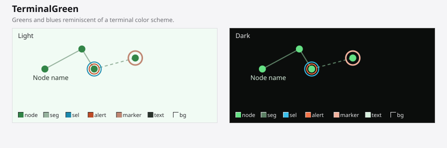

```rust
map.set_theme(std::rc::Rc::new(egui_map::map::theme::Theme::TerminalGreen));
```

| Mode | node | segment | selected | alert | marker | text | background |
|---|---|---|---|---|---|---|---|
| Light | `#328547` | `#96B29D` | `#1A89AD` | `#BF4C26` | `#BF8672` | `#29332B` | `#F1FBF4` |
| Dark | `#65E084` | `#5C8065` | `#3BBFEB` | `#F27349` | `#F2B29E` | `#D8F0DE` | `#0B0D0C` |

## `EmberForge`

Warm oranges and pinks over charcoal/cream.

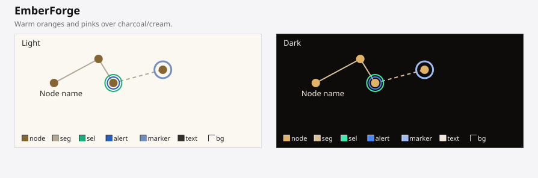

```rust
map.set_theme(std::rc::Rc::new(egui_map::map::theme::Theme::EmberForge));
```

| Mode | node | segment | selected | alert | marker | text | background |
|---|---|---|---|---|---|---|---|
| Light | `#856632` | `#B2A896` | `#1AAD7C` | `#265EBF` | `#728FBF` | `#332F29` | `#FBF7F1` |
| Dark | `#E0B365` | `#D9C198` | `#3BEBB0` | `#4987F2` | `#9EBCF2` | `#F0E7D8` | `#0D0C0B` |

## `SolarAmber`

Amber and teal on a warm neutral backdrop.

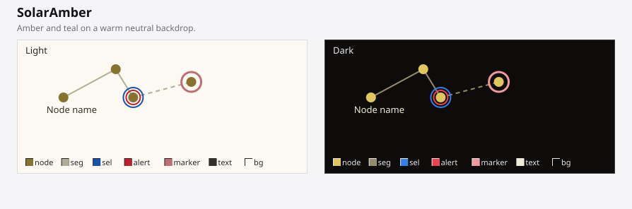

```rust
map.set_theme(std::rc::Rc::new(egui_map::map::theme::Theme::SolarAmber));
```

| Mode | node | segment | selected | alert | marker | text | background |
|---|---|---|---|---|---|---|---|
| Light | `#85732E` | `#B2AD95` | `#1353AD` | `#BF1F2C` | `#BF6F76` | `#333128` | `#FBF9F1` |
| Dark | `#E0C65F` | `#948B68` | `#327FEB` | `#F2404F` | `#F299A0` | `#F0EBD7` | `#0D0C0B` |

## `ArticCyan`

Cyan and gold over deep blue-gray.

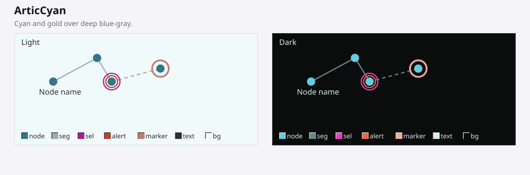

```rust
map.set_theme(std::rc::Rc::new(egui_map::map::theme::Theme::ArticCyan));
```

| Mode | node | segment | selected | alert | marker | text | background |
|---|---|---|---|---|---|---|---|
| Light | `#327785` | `#96AEB2` | `#AD1A95` | `#BF4026` | `#BF7F72` | `#293133` | `#F1FAFB` |
| Dark | `#65CCE0` | `#65868C` | `#EB3BCD` | `#F26549` | `#F2AB9E` | `#D8ECF0` | `#0B0D0D` |

## `CrimsonSignal`

Signal red and steel blue over near-black.

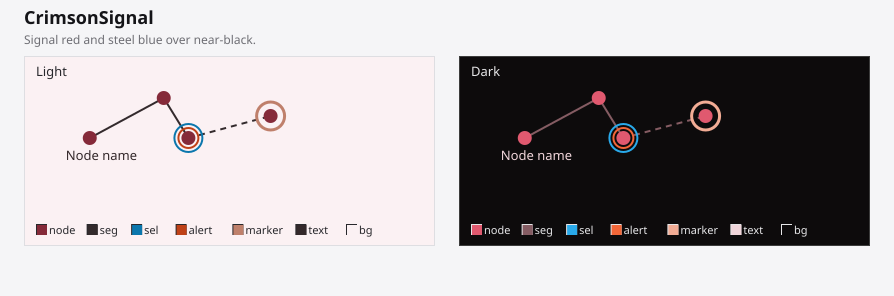

```rust
map.set_theme(std::rc::Rc::new(egui_map::map::theme::Theme::CrimsonSignal));
```

| Mode | node | segment | selected | alert | marker | text | background |
|---|---|---|---|---|---|---|---|
| Light | `#852A39` | `#332A2C` | `#0B77AD` | `#BF4117` | `#BF806B` | `#33282A` | `#FBF1F3` |
| Dark | `#E0596F` | `#855C63` | `#29AAEB` | `#F26638` | `#F2AC95` | `#F0D5DA` | `#0D0B0C` |

## `MidnightIndigo`

Indigo and teal on deep midnight blue.

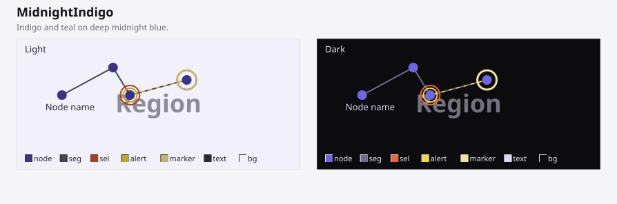

```rust
map.set_theme(std::rc::Rc::new(egui_map::map::theme::Theme::MidnightIndigo));
```

| Mode | node | segment | selected | alert | marker | text | background |
|---|---|---|---|---|---|---|---|
| Light | `#393285` | `#464552` | `#AD3F1A` | `#BFA626` | `#BFB372` | `#2A2933` | `#F2F1FB` |
| Dark | `#6F65E0` | `#6E6A94` | `#EB673B` | `#F2D649` | `#F2E49E` | `#DAD8F0` | `#0C0B0D` |

## `CopperRose`

Copper and teal over warm taupe.

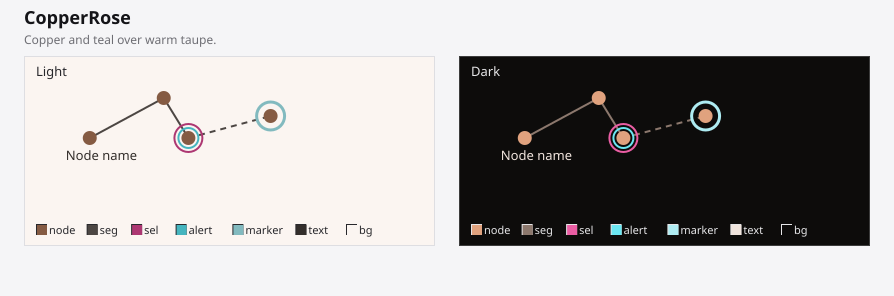

```rust
map.set_theme(std::rc::Rc::new(egui_map::map::theme::Theme::CopperRose));
```

| Mode | node | segment | selected | alert | marker | text | background |
|---|---|---|---|---|---|---|---|
| Light | `#855B43` | `#4C4643` | `#AD3772` | `#45B5BF` | `#82BABF` | `#332E2B` | `#FBF5F1` |
| Dark | `#E0A27E` | `#8C786D` | `#EB5EA4` | `#6BE7F2` | `#AEECF2` | `#F0E4DD` | `#0D0C0B` |

## `LimeCircuit`

Lime green and violet over dark olive.

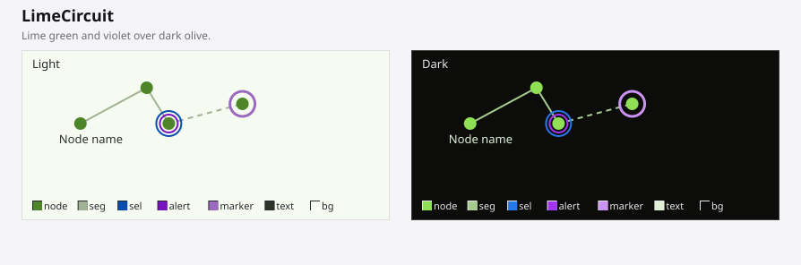

```rust
map.set_theme(std::rc::Rc::new(egui_map::map::theme::Theme::LimeCircuit));
```

| Mode | node | segment | selected | alert | marker | text | background |
|---|---|---|---|---|---|---|---|
| Light | `#4F8529` | `#A0B293` | `#084DAD` | `#7814BF` | `#9B6ABF` | `#2C3328` | `#F5FBF1` |
| Dark | `#90E056` | `#A8CC8F` | `#2678EB` | `#A334F2` | `#CA93F2` | `#E0F0D5` | `#0C0D0B` |

## `CoralReef`

Coral and ocean blue over sea-glass teal.

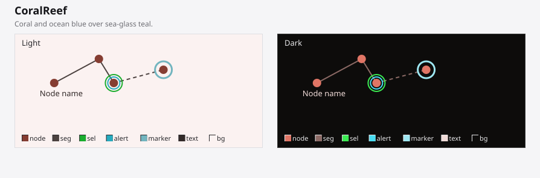

```rust
map.set_theme(std::rc::Rc::new(egui_map::map::theme::Theme::CoralReef));
```

| Mode | node | segment | selected | alert | marker | text | background |
|---|---|---|---|---|---|---|---|
| Light | `#853D32` | `#4C4240` | `#1AAD2E` | `#26ABBF` | `#72B5BF` | `#332A29` | `#FBF2F1` |
| Dark | `#E07565` | `#8C6A65` | `#3BEB52` | `#49DCF2` | `#9EE7F2` | `#F0DBD8` | `#0D0C0B` |

## `GraphiteMono`

Grayscale with a cool blue accent.

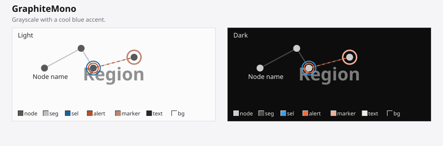

```rust
map.set_theme(std::rc::Rc::new(egui_map::map::theme::Theme::GraphiteMono));
```

| Mode | node | segment | selected | alert | marker | text | background |
|---|---|---|---|---|---|---|---|
| Light | `#595959` | `#BFBFBF` | `#176399` | `#BF4C26` | `#BF8672` | `#262626` | `#FBFBFB` |
| Dark | `#CCCCCC` | `#4C4C4C` | `#3BA1EB` | `#F26A3D` | `#F2AE98` | `#EBEBEB` | `#0D0D0D` |

## `PlumStatic`

Plum and jade over muted mauve.

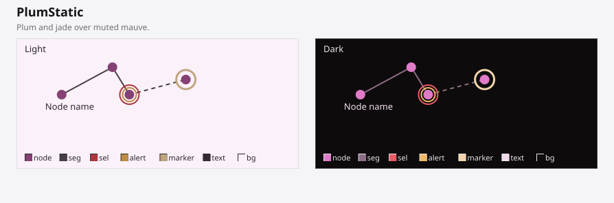

```rust
map.set_theme(std::rc::Rc::new(egui_map::map::theme::Theme::PlumStatic));
```

| Mode | node | segment | selected | alert | marker | text | background |
|---|---|---|---|---|---|---|---|
| Light | `#854174` | `#473E45` | `#AD353F` | `#BF8B42` | `#BFA580` | `#332B31` | `#FBF1F9` |
| Dark | `#E07BC7` | `#8C6C84` | `#EB5A66` | `#F2B867` | `#F2D5AC` | `#F0DCEB` | `#0D0B0C` |

## `SandstoneTrail`

Sand and clay over warm khaki.

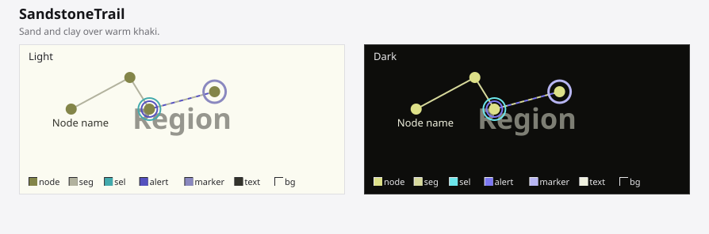

```rust
map.set_theme(std::rc::Rc::new(egui_map::map::theme::Theme::SandstoneTrail));
```

| Mode | node | segment | selected | alert | marker | text | background |
|---|---|---|---|---|---|---|---|
| Light | `#838549` | `#B2B29E` | `#43AAAD` | `#5551BF` | `#8A88BF` | `#33332C` | `#FBFBF1` |
| Dark | `#DDE088` | `#D7D99C` | `#6CE6EB` | `#7C78F2` | `#B7B5F2` | `#EFF0DE` | `#0D0D0B` |

---

`SystemDefault` is the default theme (`Theme::default()`). Every preview above and the tables alongside them are generated together, straight from `src/map/theme.rs`, by `scripts/generate_theme_gallery` (a standalone Rust tool -- run it with `cargo run --manifest-path scripts/generate_theme_gallery/Cargo.toml` from the repo root) -- if the palettes there ever change, rerun it rather than hand-editing this file or the SVGs under `theme_gallery/`.
