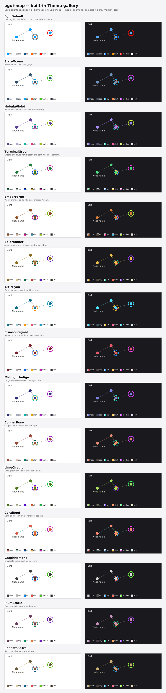

# egui-map -- built-in themes

`egui-map` ships 14 named color palettes (`map::theme::Theme`), each with a `Light` and a `Dark` variant (`map::theme::ColorMode`, a re-export of `egui::Theme`). `Theme::colors(mode)` resolves a theme to the five colors the widget actually paints with (`map::theme::ThemeColors`): the node fill, connection lines (`segment`), the selection ring around the nearest node (`selected`), notification/alert animations (`alert`), and node names/labels (`text`).

Install a built-in theme, or your own palette, with `Map::set_theme` and the `MapTheme` trait -- see the README's "Custom themes" section and the `MapTheme` rustdoc for the full API.



*Preview generated from the exact `Theme::colors` values below -- each card mocks the shapes the widget paints (nodes, connection lines, a selection ring, an alert ring) rather than being a captured screenshot of a running app.*

## `SlateOcean`

Muted blues over slate grays.

```rust
map.set_theme(std::rc::Rc::new(egui_map::map::theme::Theme::SlateOcean));
```

| Mode | node | segment | selected | alert | text |
|---|---|---|---|---|---|
| Light | `#2E4C6D` | `#8A99A8` | `#0EA5E9` | `#E0592A` | `#2B333D` |
| Dark | `#6E93BF` | `#4A5A6E` | `#38BDF8` | `#FF8A4C` | `#D7DEE6` |

## `NebulaViolet`

Violet and teal on a soft neutral backdrop. The default theme.

```rust
map.set_theme(std::rc::Rc::new(egui_map::map::theme::Theme::NebulaViolet));
```

| Mode | node | segment | selected | alert | text |
|---|---|---|---|---|---|
| Light | `#5B3E96` | `#B3A4D6` | `#16B8A6` | `#E6337A` | `#372F45` |
| Dark | `#A78BFA` | `#5C4A80` | `#2DD4BF` | `#FF5FA3` | `#E4DCF2` |

## `TerminalGreen`

Greens and blues reminiscent of a terminal color scheme.

```rust
map.set_theme(std::rc::Rc::new(egui_map::map::theme::Theme::TerminalGreen));
```

| Mode | node | segment | selected | alert | text |
|---|---|---|---|---|---|
| Light | `#1F7A3D` | `#9BB89E` | `#2563EB` | `#D6A429` | `#2A332C` |
| Dark | `#4ADE80` | `#3A5240` | `#60A5FA` | `#FFC94D` | `#D7E6DA` |

## `EmberForge`

Warm oranges and pinks over charcoal/cream.

```rust
map.set_theme(std::rc::Rc::new(egui_map::map::theme::Theme::EmberForge));
```

| Mode | node | segment | selected | alert | text |
|---|---|---|---|---|---|
| Light | `#8C4A1F` | `#C9A98C` | `#C4258C` | `#2E86AB` | `#362E28` |
| Dark | `#D97F3D` | `#5A4632` | `#F472B6` | `#4FC3E8` | `#EDE0D3` |

## `SolarAmber`

Amber and teal on a warm neutral backdrop.

```rust
map.set_theme(std::rc::Rc::new(egui_map::map::theme::Theme::SolarAmber));
```

| Mode | node | segment | selected | alert | text |
|---|---|---|---|---|---|
| Light | `#F0C24C` | `#5A4E2E` | `#4FBF9E` | `#E8654A` | `#EFE4C4` |
| Dark | `#8A6D1E` | `#D8C48F` | `#2D6E5E` | `#C1442A` | `#362E1C` |

## `ArticCyan`

Cyan and gold over deep blue-gray.

```rust
map.set_theme(std::rc::Rc::new(egui_map::map::theme::Theme::ArticCyan));
```

| Mode | node | segment | selected | alert | text |
|---|---|---|---|---|---|
| Light | `#4FE0FF` | `#375E68` | `#FBBF24` | `#FF6B95` | `#D3EAEF` |
| Dark | `#12708A` | `#9AC6D1` | `#F5A524` | `#E0527A` | `#1F2E30` |

## `CrimsonSignal`

Signal red and steel blue over near-black.

```rust
map.set_theme(std::rc::Rc::new(egui_map::map::theme::Theme::CrimsonSignal));
```

| Mode | node | segment | selected | alert | text |
|---|---|---|---|---|---|
| Light | `#7A1F2B` | `#B9A8A8` | `#1F6FEB` | `#E8A628` | `#332628` |
| Dark | `#E35B6B` | `#5C4548` | `#58A6FF` | `#FFC459` | `#E8D6D8` |

## `MidnightIndigo`

Indigo and teal on deep midnight blue.

```rust
map.set_theme(std::rc::Rc::new(egui_map::map::theme::Theme::MidnightIndigo));
```

| Mode | node | segment | selected | alert | text |
|---|---|---|---|---|---|
| Light | `#2B2F77` | `#A6A9C9` | `#00B8A9` | `#E0A400` | `#262940` |
| Dark | `#7B82E0` | `#3A3D66` | `#2DD4C8` | `#FFD166` | `#D8DAF0` |

## `CopperRose`

Copper and teal over warm taupe.

```rust
map.set_theme(std::rc::Rc::new(egui_map::map::theme::Theme::CopperRose));
```

| Mode | node | segment | selected | alert | text |
|---|---|---|---|---|---|
| Light | `#9C4A3C` | `#D9B8AE` | `#2F7A6B` | `#E0A23C` | `#3D2E29` |
| Dark | `#E08B6F` | `#5E453D` | `#4FC3AE` | `#FFC65C` | `#EFDAD0` |

## `LimeCircuit`

Lime green and violet over dark olive.

```rust
map.set_theme(std::rc::Rc::new(egui_map::map::theme::Theme::LimeCircuit));
```

| Mode | node | segment | selected | alert | text |
|---|---|---|---|---|---|
| Light | `#4D7A1F` | `#B9C79A` | `#7B3FE4` | `#E85D2E` | `#2E3320` |
| Dark | `#A8E05F` | `#445230` | `#A78BFA` | `#FF8552` | `#DCEAC0` |

## `CoralReef`

Coral and ocean blue over sea-glass teal.

```rust
map.set_theme(std::rc::Rc::new(egui_map::map::theme::Theme::CoralReef));
```

| Mode | node | segment | selected | alert | text |
|---|---|---|---|---|---|
| Light | `#D65A45` | `#A8D4CE` | `#1D5C9E` | `#F2A93C` | `#33403E` |
| Dark | `#FF8B73` | `#386560` | `#5CA8E0` | `#FFC15E` | `#D6EDE8` |

## `GraphiteMono`

Grayscale with a cool blue accent.

```rust
map.set_theme(std::rc::Rc::new(egui_map::map::theme::Theme::GraphiteMono));
```

| Mode | node | segment | selected | alert | text |
|---|---|---|---|---|---|
| Light | `#3A3A3A` | `#B8B8B4` | `#1F8FE0` | `#E0483A` | `#232323` |
| Dark | `#D6D6D2` | `#4A4A46` | `#4FB3F5` | `#FF6B5C` | `#E8E8E4` |

## `PlumStatic`

Plum and jade over muted mauve.

```rust
map.set_theme(std::rc::Rc::new(egui_map::map::theme::Theme::PlumStatic));
```

| Mode | node | segment | selected | alert | text |
|---|---|---|---|---|---|
| Light | `#6B3B5E` | `#C7AEC0` | `#2E8B6E` | `#E0793D` | `#362B33` |
| Dark | `#C994BB` | `#4A3A45` | `#52C99A` | `#FFA05C` | `#EBD9E5` |

## `SandstoneTrail`

Sand and clay over warm khaki.

```rust
map.set_theme(std::rc::Rc::new(egui_map::map::theme::Theme::SandstoneTrail));
```

| Mode | node | segment | selected | alert | text |
|---|---|---|---|---|---|
| Light | `#6B5A3A` | `#DCCBA0` | `#2A6E8C` | `#D1495B` | `#3A3121` |
| Dark | `#C9AD72` | `#4E4530` | `#4FA8CC` | `#F0708A` | `#E6D9B8` |

---

`NebulaViolet` is the default theme (`Theme::default()`). The gallery image and tables above are generated together from the same source data as `src/map/theme.rs` -- if the palettes there ever change, regenerate both.
